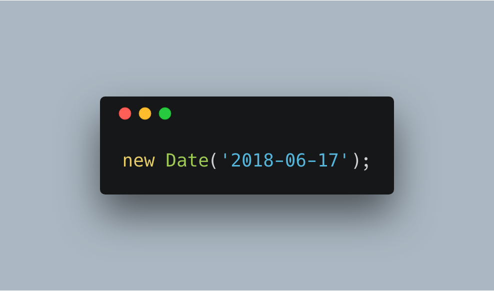
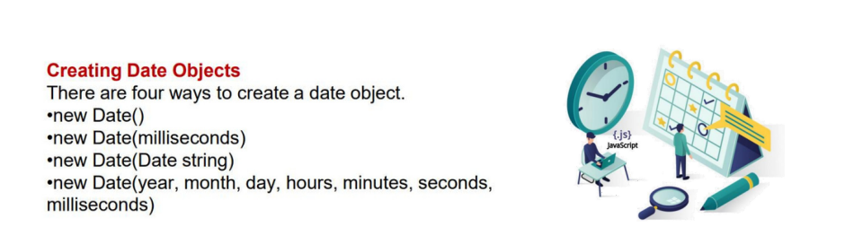
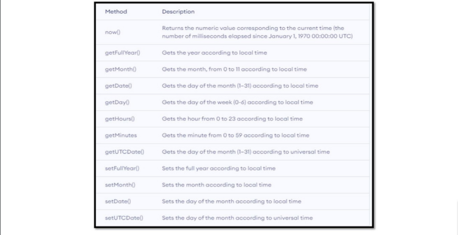
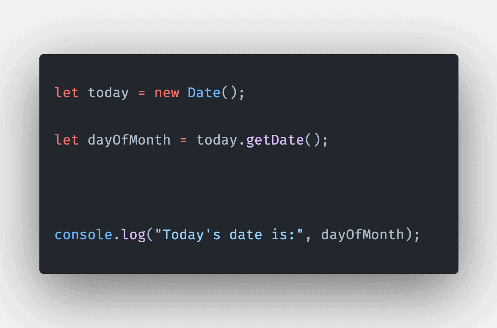
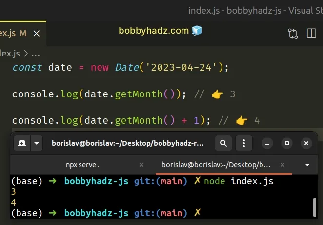
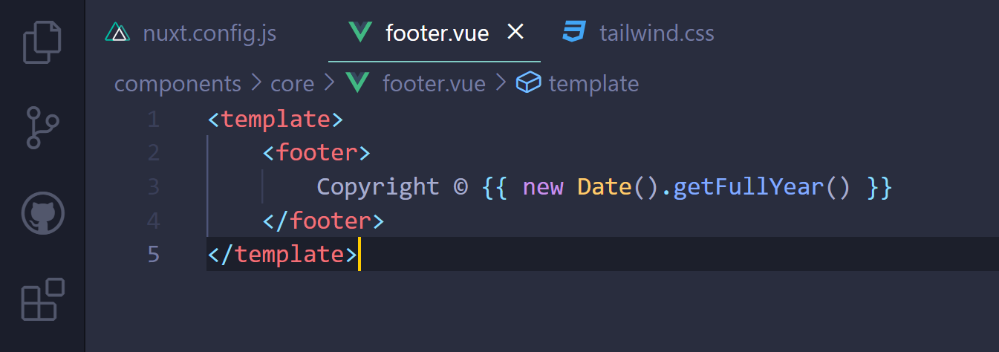

# new date() js

## JavaScript Date objects represent a single moment in time in a platform-independent format. Date objects encapsulate an integral number that represents milliseconds since the midnight at the beginning of January 1, 1970, UTC (the epoch).

# New date method

### now() method is used to return the number of milliseconds elapsed since January 1, 1970, 00:00:00 UTC

### 

### The JavaScript Date getFullYear() Method is used to fetch the year from a given Date object. Parameter: This function does not accept any parameters. Return Values: It returns the year for the given date.

### The getMonth() method of Date instances returns the month for this date according to local time, as a zero-based value (where zero indicates the first month of the year)

>

#### JavaScript - Date getDate() Method
Description. Javascript date getDate() method returns the day of the month for the specified date according to local time. ...
Syntax. Its syntax is as follows − Date.getDate()
Return Value. Returns today's date and time.
Example. Live Demo. ...
Output. javascript_date_object.htm.

### The getMonth() method of Date instances returns the month for this date according to local time, as a zero-based value (where zero indicates the first month of the year)

### The JavaScript Date getFullYear() Method is used to fetch the year from a given Date object. Parameter: This function does not accept any parameters. Return Values: It returns the year for the given date.

git init
git add README.md
git commit -m "first commit"
git branch -M main
git remote add origin https://github.com/NazarzodaAlijons/new-date.git
git push -u origin main